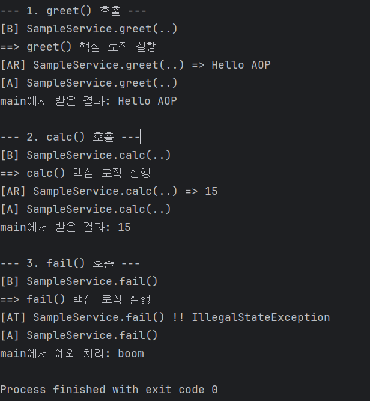

# Spring AOP 로깅 기능 구현 예제

## 📖 프로젝트 소개

이 프로젝트는 Spring AOP를 학습하기 위한 예제입니다.
`@Aspect` 어노테이션을 사용하여 서비스 계층의 메서드 호출 전후에 로그를 남기는 기능을 구현합니다.

## ✨ 주요 기능

- `@Before`: 메서드 실행 전 로그 출력
- `@AfterReturning`: 메서드 정상 실행 후 반환값 로그 출력
- `@AfterThrowing`: 메서드 예외 발생 시 로그 출력
- `@After`: 메서드 실행 종료 후 항상 로그 출력

## 🚀 실행 방법

1. 프로젝트를 Git으로 클론(clone)합니다.
2. IDE(IntelliJ, Eclipse 등)에서 Gradle 프로젝트로 빌드합니다.
3. `AopApplication.java` 파일을 실행합니다.

## 📸 실행 결과

프로젝트 실행 시 아래와 같이 AOP 로그가 콘솔에 출력됩니다.

